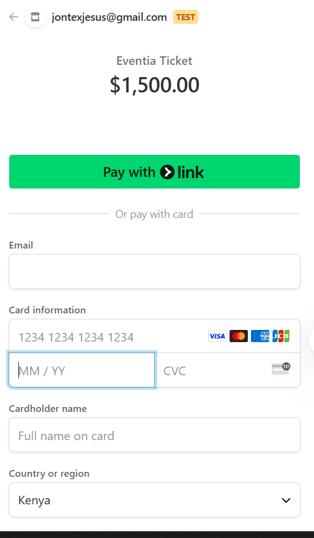

# PLP-Peer-To-Peer-Group-21 :rocket: <br>


---
## Live Links🌐📶

- **🚀Live Link on Netlify:** https://eventia-app.netlify.app/  
- **🛠️Github Link:** https://github.com/John-Mukhwana/Hackathon-Group_21 

---

## Team Structure

The development of **Eventia** was a collaborative effort carried out by two dedicated teams within **PLP-Peer-To-Peer-Group-21**:

- ### Frontend Team:
  Tasked with designing and implementing the user interface.

  - **Github Link** : https://github.com/John-Mukhwana/Hackathon-Group_21 


- ### Backend Team:
  Responsible for the server-side operations.

  - **Github Link** : https://github.com/Samboja651/event-management-system

---

# Eventia


---
## 📜 Table of Contents

- [Introduction](#introduction)
- [Team Structure](#team-structure)
- [Features](#features)
- [Technologies Used](#technologies-used)
- [Installation](#installation)
- [Usage](#usage)
- [Stripe](#stripe)
- [Project Structure](#project-structure)
- [Contributing](#contributing)
- [License](#license)
- [Contact](#contact)

--- 

## Introduction

Eventia is a comprehensive event management platform designed to streamline the organization and execution of events. Whether you're planning a conference, workshop, or social gathering, Eventia provides the tools you need to manage registrations, track attendance, and facilitate seamless communication between organizers and participants.

--- 

## Features

- **User Authentication:** Secure sign-up and login functionalities with role-based access (User and Admin).
- **Profile Management:** Users can create and manage their profiles, including personal and contact information.
- **Dashboard:** Personalized dashboards for users and admins to manage events effectively.
- **Responsive Design:** Optimized for various devices to ensure a consistent user experience.
- **Real-time Notifications:** Instant feedback and notifications using `react-toastify`.
- **Secure Password Handling:** Passwords are hashed using `bcryptjs` for enhanced security.
- **Navigation:** Intuitive navigation using `react-router-dom` and `react-icons`.

---

## Technologies Used

- **Frontend:**
  - React.js
  - React Router DOM
  - React Icons
  - React Toastify
  - Bcrypt.js
  - Tailwind CSS

- **Backend & Authentication:**
  - Flask
  - Supabase
    - Authentication
    - Postgres Database
    - Row-Level Security (RLS) Policies

- **Development Tools:**
  - Visual Studio Code
  - Git & GitHub

--- 

## Installation

### Prerequisites

- **Node.js**: Ensure you have Node.js installed. You can download it from [here](https://nodejs.org/).
- **Git**: Install Git from [here](https://git-scm.com/).

### Steps

1. **Clone the Repository**

   ```bash
   git clone https://github.com/your-username/eventia.git
   cd eventia

2.  ```bash
   pnpm init
  
---

## Usage 

### Running the Application

1. **Install Dependencies**

  ```bash
  pnpm install
  ```

2. **Start the Development Server**

  ```bash
  pnpm start
  ```

  The application should now be running on `http://localhost:3001`.

--- 

## Stripe
### Integration with Stripe

### Test for succesful payment using this card information for testing or any tastable numbers

```bash
echo "Card Number: 4242 4242 4242 4242"
echo "Card Expiry: Any valid future date (e.g., 12/34)"
echo "CVC: Any 3-digit number (e.g., 123)"
echo "ZIP Code: Any 5-digit number (e.g., 12345)"
```



Eventia uses Stripe for secure and efficient payment processing. The integration involves the following steps:

1. **Stripe Account Setup**: Create a Stripe account and obtain the API keys.
2. **Frontend Integration**: Use Stripe's React library to handle payment forms and tokenization.
3. **Backend Integration**: Implement endpoints in the backend to handle payment intents and confirmations using Flask.
4. **Environment Variables**: Store API keys and other sensitive information in environment variables for security.
5. **Testing**: Use Stripe's test mode to ensure the payment flow works correctly before going live.

For detailed instructions, refer to the [Stripe Documentation](https://stripe.com/docs).

--- 

## Project Structure

```plaintext
eventia/
├── public/
│   ├── index.html
│   └── ...
├── src/
│   ├── assets/
│   ├── components/
│   ├── pages/
│   ├── App.js
│   └── ...
├── .gitignore
├── package.json
└── README.md
```
---

## Contributing

We welcome contributions from the community. Please follow these steps to contribute:

1. Fork the repository.
2. Create a new branch (`git checkout -b feature-branch`).
3. Make your changes.
4. Commit your changes (`git commit -m 'Add new feature'`).
5. Push to the branch (`git push origin feature-branch`).
6. Open a pull request.

---

## License

This project is licensed under the MIT License. See the [LICENSE](LICENSE) file for details.

---

## Contact

For any inquiries or feedback, please contact us at:

- **Email:** eventia@gmail.com
- **GitHub :** https://github.com/John-Mukhwana/Hackathon-Group_21
- **Twitter:** [@eventia](https://twitter.com/eventia)