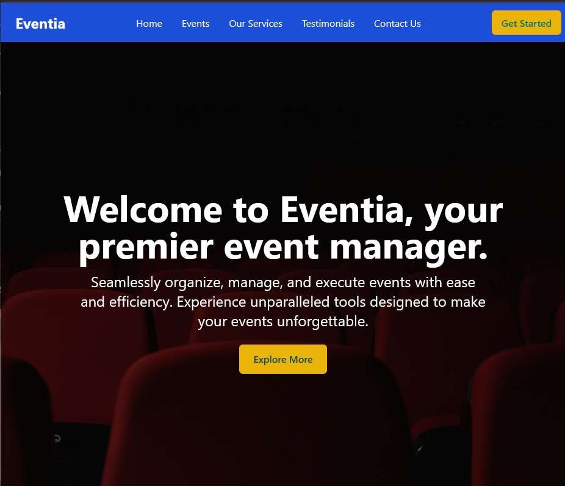

# PLP-Peer-To-Peer-Group-21 :rocket: <br>


---
## Live Links🌐📶

- **🚀Live Link on Netlify:** https://eventia-app.netlify.app/ 
- **🚀Live Link on Vercel:** https://frontend-hackathon-beta.vercel.app/  
- **🛠️Github Link:** https://github.com/John-Mukhwana/Hackathon-Group_21 

---

## Team Structure

The development of **Eventia** was a collaborative effort carried out by two dedicated teams within **PLP-Peer-To-Peer-Group-21**:

- ### Frontend Team:
  Tasked with designing and implementing the user interface.

  - **Github Link** : https://github.com/John-Mukhwana/Hackathon-Group_21 


- ### Backend Team:
  Responsible for the server-side operations.

  - **Github Link** : https://github.com/Samboja651/event-management-system

---

# Eventia



---
## 📜 Table of Contents

- [Introduction](#introduction)
- [Team Structure](#team-structure)
- [Features](#features)
- [Technologies Used](#technologies-used)
- [Installation](#installation)
- [Usage](#usage)
- [Project Structure](#project-structure)
- [Contributing](#contributing)
- [License](#license)
- [Contact](#contact)

## Introduction

Eventia is a comprehensive event management platform designed to streamline the organization and execution of events. Whether you're planning a conference, workshop, or social gathering, Eventia provides the tools you need to manage registrations, track attendance, and facilitate seamless communication between organizers and participants.

## Features

- **User Authentication:** Secure sign-up and login functionalities with role-based access (User and Admin).
- **Profile Management:** Users can create and manage their profiles, including personal and contact information.
- **Dashboard:** Personalized dashboards for users and admins to manage events effectively.
- **Responsive Design:** Optimized for various devices to ensure a consistent user experience.
- **Real-time Notifications:** Instant feedback and notifications using `react-toastify`.
- **Secure Password Handling:** Passwords are hashed using `bcryptjs` for enhanced security.
- **Navigation:** Intuitive navigation using `react-router-dom` and `react-icons`.

## Technologies Used

- **Frontend:**
  - React.js
  - React Router DOM
  - React Icons
  - React Toastify
  - Bcrypt.js
  - Tailwind CSS

- **Backend & Authentication:**
  - Flask
  - Supabase
    - Authentication
    - Postgres Database
    - Row-Level Security (RLS) Policies

- **Development Tools:**
  - Visual Studio Code
  - Git & GitHub

## Installation

### Prerequisites

- **Node.js**: Ensure you have Node.js installed. You can download it from [here](https://nodejs.org/).
- **Git**: Install Git from [here](https://git-scm.com/).

### Steps

1. **Clone the Repository**

   ```bash
   git clone https://github.com/your-username/eventia.git
   cd eventia